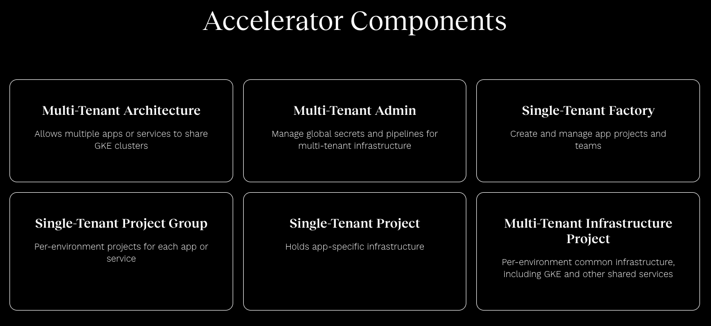

# Solution: GKE Accelerator

## Simplify the deployment of everything you need to start containerized app development.

### Overview
With growing market pressure to remedy legacy applications, rapid speed of adoption became a critical need among organizations in the industries we serve.

It prompted 66degrees to release the GKE Accelerator, which simplifies the end-to-end deployment of everything needed for clients to start containerized app development or modernization.

Through Terraform and Cloud Build scripts, we cut deployment time of a full GKE environment from weeks to just 1 to 2 days — while making sure clients feel confident and in control at every step.

https://66degrees.com/gke-accelerator/

